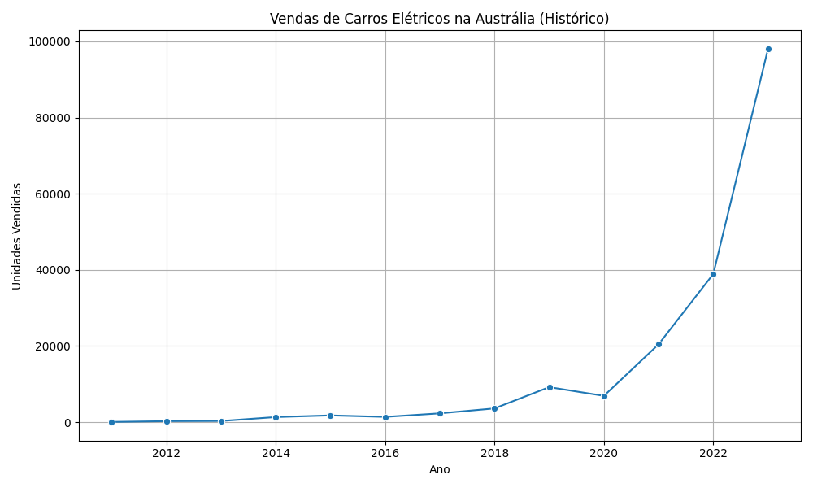

# 📈 Análise de Vendas de Carros Elétricos (2010–2024)

Este projeto tem como objetivo aplicar técnicas de mineração de dados sobre um conjunto de dados referente à evolução das vendas de veículos elétricos no mundo, com foco especial na Austrália. O trabalho foi realizado com base nos conceitos aprendidos em aula.

## 🔍 Dataset Utilizado

- **Nome**: Electric Car Sales (2010–2024)
- **Origem**: [Kaggle - Jainaru](https://www.kaggle.com/datasets/jainaru/electric-car-sales-2010-2024)
- **Arquivo**: `IEA-EV-dataEV salesHistoricalCars.csv`
- **Registros**: aproximadamente 4.000
- **Colunas**: 8 colunas:
  - `region`: região geográfica
  - `category`: tipo de dado (histórico, projeção, etc)
  - `parameter`: tipo de métrica (ex: EV sales)
  - `mode`: tipo de transporte (ex: cars, buses)
  - `powertrain`: tipo de motorização elétrica
  - `year`: ano do dado
  - `unit`: unidade de medida
  - `value`: valor registrado

## ⚙️ Técnica Aplicada

Foi utilizada uma técnica de **regressão com Random Forest** para prever a quantidade de vendas de veículos elétricos com base em variáveis como:

- Região
- Tipo de motorização (powertrain)
- Ano

A técnica foi implementada em Python utilizando as bibliotecas:

- `pandas`
- `matplotlib`
- `seaborn`
- `scikit-learn`

## 📊 Resultados

- 📈 **Gráfico**: Evolução das vendas de veículos elétricos na Austrália entre 2011 e 2024.  
  

- 🧮 **Erro Quadrático Médio (MSE)** da regressão: calculado no terminal após a execução do script `trabalho.py`.

- 💻 **Script Python**: disponível no arquivo [`trabalho.py`](trabalho.py), com todos os passos desde o carregamento até o treinamento e avaliação do modelo.

## 🛠️ Como Reproduzir

1. Clone este repositório:

   ```bash
   git clone https://github.com/allanknecht/mineracao-dados-veiculos-eletricos.git
   cd mineracao-dados-veiculos-eletricos
   ```

2. Instale os pacotes necessários (recomenda-se ambiente Python 3.9+):

   ```bash
   pip install pandas matplotlib seaborn scikit-learn
   ```

3. Execute o script:

   ```bash
   python trabalho.py
   ```

## 📄 Relatório

O relatório completo contendo os gráficos, resultados e descrição do modelo está disponível no arquivo .PDF neste repositório.

---
